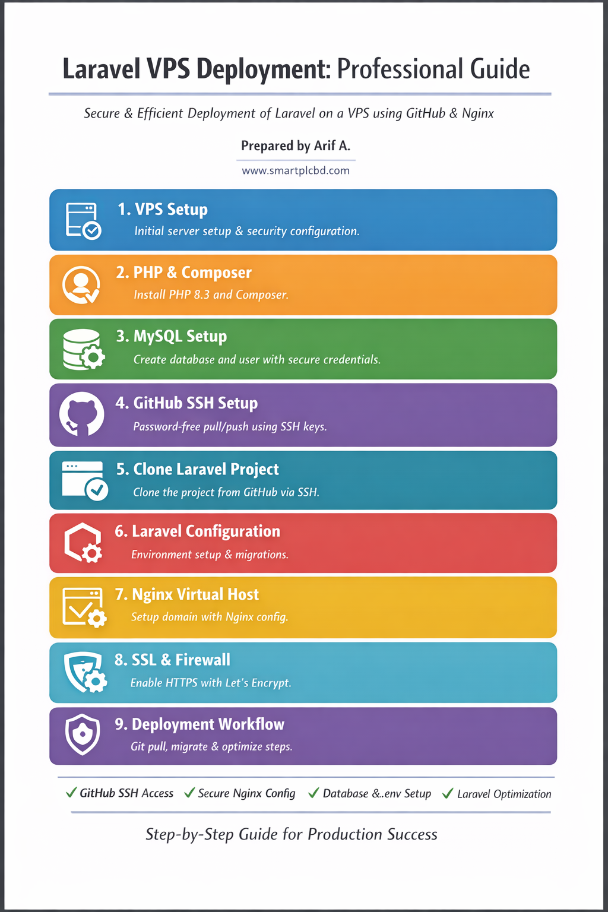

# Laravel VPS Deployment & GitHub SSH Setup

**Professional VPS Deployment Workflow with phpMyAdmin Access**  

Prepared by: Arif A.  

---

## Overview

This guide covers the complete deployment of a Laravel project on a VPS with:

- PHP 8.3 setup
- MySQL database setup
- GitHub SSH (password-free pull/push)
- Laravel project setup
- Nginx Virtual Host configuration
- phpMyAdmin access for MySQL
- Optional SSL with Let's Encrypt
- Deployment workflow automation

---

## 1. VPS Initial Setup

Login to VPS:

```bash
ssh root@<VPS_IP>


Update system & install essential packages:

apt update && apt upgrade -y
apt install git unzip curl wget ufw -y


Enable firewall:

ufw allow 80
ufw allow 443
ufw enable
ufw status


Explanation:

ufw allow 80/443 opens HTTP/HTTPS ports

ufw enable activates firewall

2. PHP & Composer Setup

Install PHP 8.3 + common extensions for Laravel:

apt install php8.3-cli php8.3-fpm php8.3-mysql php8.3-mbstring php8.3-xml php8.3-curl php8.3-zip php8.3-bcmath -y
systemctl restart php8.3-fpm


Install Composer:

curl -sS https://getcomposer.org/installer | php
mv composer.phar /usr/local/bin/composer
composer -V


Explanation: Composer is required to install Laravel dependencies.

3. MySQL Database Setup

Install MySQL:

apt install mysql-server -y
systemctl start mysql
systemctl enable mysql


Create database & user:

mysql -u root -p

CREATE DATABASE backbone_db;
CREATE USER 'backbone_user'@'localhost' IDENTIFIED BY 'StrongPassword123!';
GRANT ALL PRIVILEGES ON backbone_db.* TO 'backbone_user'@'localhost';
FLUSH PRIVILEGES;
EXIT;


Explanation:

backbone_db → database name

backbone_user → database user for Laravel

4. GitHub SSH Setup (Password-Free Pull/Push)
4.1 Check Existing SSH Keys
ls -l ~/.ssh/

4.2 Generate New SSH Key
ssh-keygen -t ed25519 -C "vps@smartplcbd"

"vps@smartplcbd" your github email
Press Enter for defaults and leave passphrase empty.

4.3 Copy Public Key
cat ~/.ssh/id_ed25519.pub


Copy the entire line (starts with ssh-ed25519).

4.4 Add Key to GitHub

GitHub → Settings → SSH and GPG keys → New SSH Key

Title: VPS SmartPLC 

Key: Paste copied key → Save

4.5 Start SSH Agent & Add Key
eval "$(ssh-agent -s)"
ssh-add ~/.ssh/id_ed25519

4.6 Test SSH Connection
ssh -T git@github.com


Expected response:

Hi Arif46! You've successfully authenticated, but GitHub does not provide shell access.

4.7 Clone Project via SSH
cd /var/www
git clone git@github.com:Arif46/smart-plc-eco-system.git
cd smart-plc-eco-system

5. Laravel Project Setup
5.1 Environment Configuration
cp .env.example .env
nano .env


Update .env:

APP_NAME=SmartPLC
APP_ENV=production
APP_KEY=
APP_DEBUG=false
APP_URL=http://<VPS_IP>

DB_CONNECTION=mysql
DB_HOST=127.0.0.1
DB_PORT=3306
DB_DATABASE=backbone_db
DB_USERNAME=backbone_user
DB_PASSWORD=StrongPassword123!

5.2 Install Dependencies & Migrate
composer install
php artisan key:generate
php artisan migrate
php artisan db:seed   # optional
php artisan storage:link
php artisan optimize

5.3 File Permissions
chown -R www-data:www-data /var/www/smart-plc-eco-system
chmod -R 775 storage bootstrap/cache


Explanation: Laravel needs storage and bootstrap/cache writable by web server.

6. Nginx Virtual Host
6.1 Create Config
nano /etc/nginx/sites-available/backbone.smartplcbd.com.conf


Paste:

server {
    listen 80;
    server_name backbone.smartplcbd.com www.backbone.smartplcbd.com;

    root /var/www/smart-plc-eco-system/public;
    index index.php index.html index.htm;

    add_header X-Frame-Options "SAMEORIGIN";
    add_header X-Content-Type-Options "nosniff";

    location / {
        try_files $uri $uri/ /index.php?$query_string;
    }

    location ~ \.php$ {
        include snippets/fastcgi-php.conf;
        fastcgi_pass unix:/run/php/php8.3-fpm.sock;
        fastcgi_param SCRIPT_FILENAME $realpath_root$fastcgi_script_name;
        include fastcgi_params;
    }

    location ~ /\.(?!well-known).* {
        deny all;
    }
}

## Save & exit:

## Ctrl+O → Enter → Ctrl+X

6.2 Enable & Reload Nginx
ln -s /etc/nginx/sites-available/backbone.smartplcbd.com.conf /etc/nginx/sites-enabled/
nginx -t
systemctl reload nginx

7. phpMyAdmin Setup
7.1 Install phpMyAdmin
apt install phpmyadmin -y


7.2. Create new Nginx config for phpMyAdmin

## sudo nano /etc/nginx/sites-available/phpmyadmin.conf


##phpmyadmin.conf 

server {
    listen 80;
    server_name 167.172.77.185;

    root /usr/share/phpmyadmin;
    index index.php index.html;

    location /phpmyadmin {
        alias /usr/share/phpmyadmin/;
        index index.php;

        location ~ \.php$ {
            include snippets/fastcgi-php.conf;
            fastcgi_pass unix:/run/php/php8.3-fpm.sock;
            fastcgi_param SCRIPT_FILENAME $request_filename;
        }

        location ~* \.(js|css|png|jpg|jpeg|gif|ico|html|xml|txt)$ {
            expires max;
            log_not_found off;
        }
    }
}

## Save & exit:

## Ctrl+O → Enter → Ctrl+X

Enable this site

## sudo ln -s /etc/nginx/sites-available/phpmyadmin.conf /etc/nginx/sites-enabled/

Test Nginx config

## sudo nginx -t

if ok then reload 

sudo systemctl reload nginx

Select nginx (configure manually if not shown)

Enable dbconfig-common → Enter MySQL root password

7.2 Configure Nginx for phpMyAdmin
ln -s /usr/share/phpmyadmin /var/www/html/phpmyadmin
systemctl reload nginx


Access MySQL via:

http://<VPS_IP>/phpmyadmin


Login with backbone_user or root credentials

8. Optional SSL (Let's Encrypt)
apt install certbot python3-certbot-nginx -y
certbot --nginx -d backbone.smartplcbd.com -d www.backbone.smartplcbd.com
systemctl reload nginx

9. Deployment Workflow

Pull latest code on VPS:

cd /var/www/smart-plc-eco-system
git pull origin master
composer install --no-dev
php artisan migrate --force
php artisan optimize:clear
chown -R www-data:www-data .
chmod -R 775 storage bootstrap/cache


Optional deploy script (deploy.sh) to automate updates

# Project Architecture

Here is the system architecture diagram:



Or using HTML to control size:

